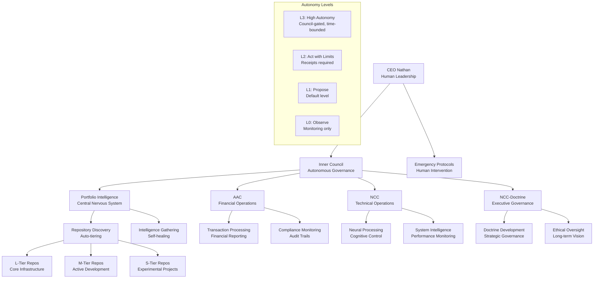
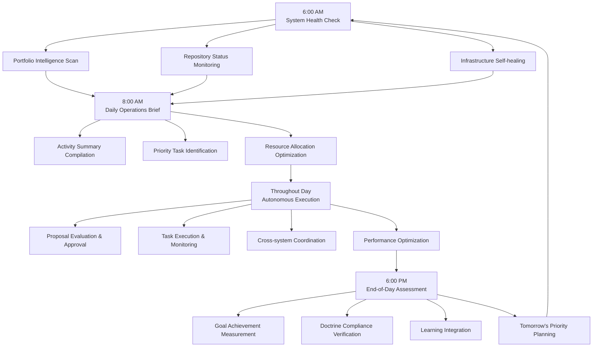
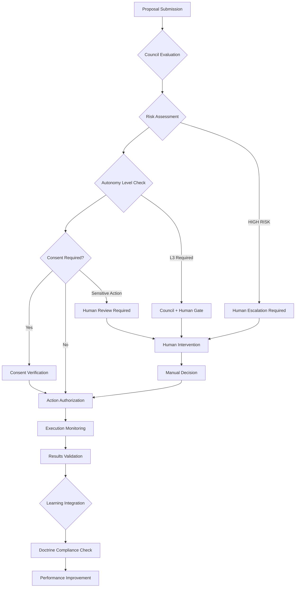
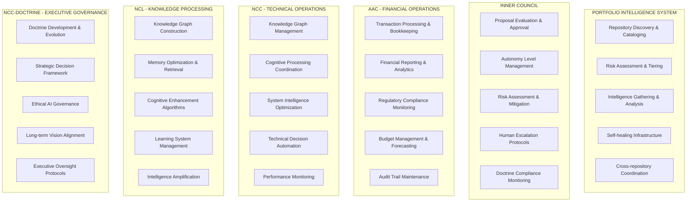

# Super Agency Operational Architecture Diagrams

## 🏗️ Organizational Hierarchy Chart



## 📊 Data Flow Architecture

```mermaid
graph LR
    subgraph "INPUT SOURCES"
        A[GitHub API<br/>Repository Data]
        B[Financial Feeds<br/>Market Data]
        C[User Commands<br/>Interaction Requests]
        D[System Telemetry<br/>Performance Metrics]
    end

    subgraph "INTELLIGENCE LAYER"
        E[Portfolio Intelligence<br/>Discovery & Analysis]
        F[Auto-tiering<br/>Risk Assessment]
        G[Intelligence Gathering<br/>Content Analysis]
        H[Self-healing<br/>Infrastructure Maintenance]
    end

    subgraph "DECISION GATEWAY"
        I[Council Evaluation<br/>Autonomy Assessment]
        J[Consent Verification<br/>Privacy Checks]
        K[Risk Assessment<br/>Human Escalation]
        L[Action Authorization<br/>Execution Approval]
    end

    subgraph "EXECUTION LAYER"
        M[Agent Orchestration<br/>Task Coordination]
        N[SASP Protocol<br/>Cross-system Communication]
        O[Resource Allocation<br/>Doctrine-guided Deployment]
        P[Performance Optimization<br/>Continuous Improvement]
    end

    subgraph "MONITORING & LEARNING"
        Q[Real-time Telemetry<br/>Health Tracking]
        R[Results Validation<br/>Goal Measurement]
        S[Learning Integration<br/>Performance Improvement]
        T[Doctrine Compliance<br/>Integrity Verification]
    end

    A --> E
    B --> E
    C --> E
    D --> E

    E --> F
    F --> G
    G --> H

    H --> I
    I --> J
    J --> K
    K --> L

    L --> M
    M --> N
    N --> O
    O --> P

    P --> Q
    Q --> R
    R --> S
    S --> T

    T --> E
```



## 🔄 Operational Workflow Cycle



## 🎯 Decision-Making Workflow



## 📋 Responsibility Matrix



## 🎯 Goal Achievement Flow

```mermaid
graph TD
    A[Mission Statement<br/>NORTH STAR] --> B[Strategic Objectives<br/>Doctrine Principles]
    B --> C[Tactical Goals<br/>Portfolio Tiers]
    C --> D[Operational Tasks<br/>Agent Actions]

    D --> E[Autonomous Execution<br/>L1-L3 Levels]
    E --> F[Results Monitoring<br/>Performance Metrics]
    F --> G[Success Measurement<br/>Goal Achievement]

    G --> H{Feedback Loop}
    H -->|Success| I[Reinforcement Learning<br/>Optimization]
    H -->|Failure| J[Doctrine Review<br/>Process Improvement]

    I --> B
    J --> B

    K[Human Oversight<br/>Council Intervention] --> E
    L[Emergency Protocols<br/>Human Escalation] --> E
```</content>
<parameter name="filePath">c:\Users\gripa\OneDrive - Grip and Ripp\Super Agency\Super-Agency\OPERATIONAL_ARCHITECTURE_DIAGRAMS.md