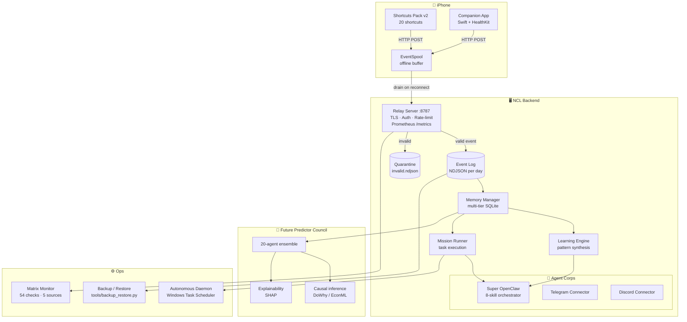

# NUREALCORTEXLINK (NCL) v3.0

Neuro-Digital Symbiosis for Cognitive Augmentation

NUREALCORTEXLINK is a second brain system that extends human cognition through seamless integration of biological and digital intelligence. It captures iPhone data streams, synthesizes insights, and maintains collective intelligence across human and AI agents.

## 🧠 Core Mission

Transform human cognition through:

- **Transactive Memory**: Collective knowledge storage across biological/digital systems
- **Digital Gardens**: Evolving knowledge spaces with bi-directional linking
- **CODE Methodology**: Capture → Organize → Distill → Express knowledge processing
- **Atomic Notes**: Zettelkasten methodology for granular, interconnected knowledge

## 🏗️ System Architecture



### Core Components

- **iOS Companion App**: Primary UI, sensor hub, and data router
- **Python Backend**: Schema validation, doctrine generation, evaluation harness
- **Knowledge Graph**: Obsidian/Notion integration for digital gardens
- **Agent Corps**: Specialized AI agents for cognitive tasks

### Data Pipeline

1. **Capture**: iPhone sensors collect high-signal, low-invasion data (60 event types)
2. **Validate**: JSON Schema validation — valid events stored, invalid quarantined
3. **Process**: AI agents apply CODE methodology via `ncl_agency_runtime`
4. **Synthesize**: Insights integrated into memory tiers (working → short-term → long-term)
5. **Express**: Actionable outputs via Telegram bot, Mission Runner, FPC forecasts

## 🏃‍♂️ Quick Start

### Prerequisites

- Python 3.9+
- iOS device with Shortcuts app
- Obsidian or Notion for knowledge management

### Installation

```bash
# Clone repository
git clone https://github.com/ResonanceEnergy/NCL.git
cd NCL

# Set up virtual environment
python -m venv .venv
.venv\Scripts\activate  # Windows
# source .venv/bin/activate  # macOS/Linux

# Install dependencies
pip install -r requirements-dev.txt
```

### One-Drop Setup (Product Development)

For comprehensive product development with roadmap tracking and progress monitoring:

```bash
# Navigate to One-Drop setup
cd ncl_onedrop_setup

# Run setup script
python onedrop_setup.py install

# Start development API
python -m uvicorn backend.api.main:app --reload --port 8123

# Access endpoints:
# - Health check: http://localhost:8123/health
# - Progress tracking: http://localhost:8123/progress
# - Roadmap data: http://localhost:8123/roadmap
```

The One-Drop setup includes:

- **100-step product roadmap** with detailed implementation guidance
- **Task management system** with owner assignments and exit criteria
- **Progress tracking API** for development milestones
- **VS Code integration** for streamlined development workflow

### Basic Usage

```bash
# Run tests
python -m pytest tests/ -v

# Build doctrine
cd ncl_gbx_one_drop && python build.py

# Run golden task evaluation
python evaluation_harness.py --all --report
```

## 📊 Golden Task Evaluation System

NUREALCORTEXLINK includes a comprehensive evaluation framework for AI agent performance:

### Available Tasks

- **Summarization**: Inbox and note condensation
- **Action Extraction**: Meeting note processing
- **Knowledge Organization**: PARA methodology application
- **CODE Insights**: Cognitive processing evaluation
- **Pattern Recognition**: Biometric trend analysis

### Running Evaluation

```bash
# Evaluate all tasks
python evaluation_harness.py --all --verbose

# Generate detailed report
python evaluation_harness.py --all --report

# Test specific task
python evaluation_harness.py --task-id golden_0001
```

### Current Performance

- **Tasks**: 5 production-ready golden tasks
- **Pass Rate**: 100% (all tasks passing)
- **Test Coverage**: 16 unit tests
- **CI Integration**: Automated quality gates

## 📱 iOS Integration

### Data Collection

The iOS companion app captures 150+ insight types across:

- **Device Usage**: Screen time, notifications, app usage
- **Health Metrics**: Heart rate, sleep, activity patterns
- **Environmental**: Location, connectivity, battery status
- **Behavioral**: Habits, routines, social patterns

### Schema Validation

All data validated against JSON schemas in `schemas/ncl.iphone.v1/`:

- **Envelope Schema**: Common event structure
- **Event Schemas**: 43+ specific event type definitions
- **Validation**: Real-time schema compliance checking

## 🧪 Development

### Testing

```bash
# Run full test suite
python -m pytest tests/ -v

# Run specific test file
python -m pytest tests/test_evaluation_harness.py -v

# Run with coverage
python -m pytest --cov=. tests/
```

### Code Quality

- **Linting**: Follow PEP 8 standards
- **Type Hints**: Full type annotation coverage
- **Documentation**: Comprehensive docstrings
- **CI/CD**: GitHub Actions for automated testing

## 📚 Documentation

### Key Documents

- **[Master Doctrine](NCC_Master_Doctrine_v2.0.md)**: Complete system architecture and operating principles
- **[Golden Task Integration](evaluation/GOLDEN_TASK_INTEGRATION.md)**: Evaluation system documentation
- **[GBX Doctrine](ncl_gbx_one_drop/dist/ncl_dox_gbx_001.md)**: iPhone exploitation framework
- **[Module Map](ios/CompanionApp/MODULE_MAP.md)**: iOS app architecture

### Architecture Decisions

- **Local-First**: Default to local processing, cloud optional
- **Privacy-First**: Metadata-only collection, user consent required
- **Event-Driven**: Structured data extraction over raw streams
- **Test-Driven**: Golden tasks ensure AI reliability

## 🤝 Contributing

### Development Workflow

1. **Branch**: Create feature branch from `main`
2. **Develop**: Write tests first, implement functionality
3. **Test**: Ensure all tests pass, including golden tasks
4. **Document**: Update relevant documentation
5. **PR**: Submit pull request with comprehensive description

### Code Standards

- **Python**: PEP 8 compliant, type hints required
- **Swift**: SwiftLint compliant, protocol-oriented design
- **Testing**: 100% test coverage for new features
- **Documentation**: All public APIs documented

## 📈 Roadmap

### Phase 1: Core Enhancement (Current)

- ✅ Golden task evaluation system
- ✅ Second brain doctrine v3.0
- ✅ iOS data collection framework
- 🔄 Real AI agent integration

### Phase 2: Advanced Capabilities (Q2 2026)

- Multi-modal data processing
- Real-time pattern recognition
- Cross-device synchronization
- Advanced knowledge graphs

### Phase 3: Ecosystem Expansion (Q3 2026)

- Third-party integrations
- Community golden tasks
- Advanced AI agent training
- Enterprise deployment options

## 📄 License

This project is licensed under the terms specified in individual component licenses.

## 🙏 Acknowledgments

NUREALCORTEXLINK builds upon research in:

- **Cognitive Science**: Transactive memory systems, cognitive load theory
- **Knowledge Management**: Zettelkasten, PARA methodology, digital gardens
- **AI Safety**: Deterministic evaluation, bias detection, reliability testing
- **Privacy Engineering**: Consent frameworks, data minimization, user control

---

> "If it isn't captured, it isn't trusted. If it isn't governed, it isn't real."

*Supreme Commander: Nathan Christopher Ludwig*  
*Codename: NUREALCORTEXLINK*
