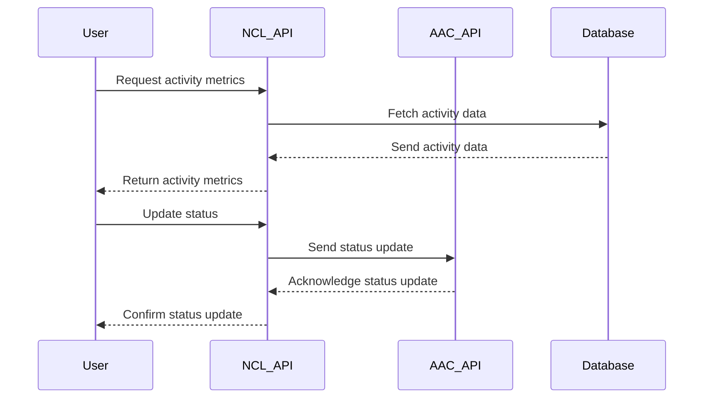

# INTEGRATION_DESIGN.md

## 1. Integration Overview
This document outlines the design for integrating the "NCL" repository with other repositories in the portfolio and external services. The aim is to ensure seamless communication and data exchange to enhance functionality, maintain data integrity, and improve overall system performance.

## 2. Current Integration Points
Currently, the "NCL" repository integrates with:
- Internal logging services for audit trails
- A database service for persistent data storage
- Basic API endpoints for data retrieval by external consumers

## 3. Proposed Integrations

### With Other Portfolio Repositories
1. **AAC**:
   - **Purpose**: To share user activity metrics.
   - **Mechanism**: RESTful API exposure from "NCL" for AAC to query data.
   
2. **Adventure-Hero-Chronicles-Of-Glory**:
   - **Purpose**: To synchronize game status updates.
   - **Mechanism**: Webhooks for real-time updates from "NCL".
   
3. **ADVENTUREHEROAUTO**:
   - **Purpose**: Automated testing of game scenarios using new data from "NCL".
   - **Mechanism**: JSON data exchange through API.

4. **CIVIL-FORGE-TECHNOLOGIES-**:
   - **Purpose**: To share map data for infrastructure planning.
   - **Mechanism**: GraphQL queries for data pulling.
   
5. **Crimson-Compass**:
   - **Purpose**: To integrate navigation routes based on real-time data.
   - **Mechanism**: Scheduled data push from "NCL" to a shared central service.

### External Service Integrations
1. **Payment Gateway Service**:
   - **Purpose**: To handle transactions securely.
   - **Mechanism**: Secure API integration with OAuth 2.0.

2. **Third-Party Analytics Service**:
   - **Purpose**: To aggregate user engagement data.
   - **Mechanism**: Daily batch upload of anonymized data.

## 4. API Design

### NCL Public API
- **Base URL**: `/api/v1/ncl`
- **Endpoints**:
  - `GET /activityMetrics`: Fetch user activity metrics.
  - `POST /updateStatus`: Update status with provided data.
  - `GET /mapData`: Retrieve map data.

### Authentication
- Use of JWT tokens for secure API access.
- OAuth 2.0 for external service integrations.

### Example Endpoint Design
**GET /activityMetrics**

```json
{
  "description": "Fetch user activity metrics",
  "responses": {
    "200": {
      "description": "successful operation",
      "content": {
        "application/json": {
          "schema": {
            "type": "object",
            "properties": {
              "userId": {
                "type": "string"
              },
              "activity": {
                "type": "array",
                "items": {
                  "type": "object",
                  "properties": {
                    "timestamp": {
                      "type": "string"
                    },
                    "action": {
                      "type": "string"
                    }
                  }
                }
              }
            }
          }
        }
      }
    }
  }
}
```

## 5. Data Flow Diagrams (Mermaid)



## 6. Authentication & Authorization
- Implement JWT for authenticating users.
- Use role-based access control (RBAC) to manage permissions.

## 7. Error Handling Strategy
- Standardized error response formats.
- Logging for failed transactions.
- Retry mechanisms for transient errors.

## 8. Implementation Phases
1. **Phase 1**: Setup JWT and enhance current APIs
2. **Phase 2**: Implement integration with AAC & Adventure-Hero-Chronicles-Of-Glory
3. **Phase 3**: Integrate with external payment gateway and analytics services
4. **Phase 4**: Testing & Deployment

## 9. Testing Strategy for Integrations
- **Unit Tests**: For API endpoints and key functions.
- **Integration Tests**: To verify interactions between "NCL" and other portfolio repositories.
- **End-to-End Tests**: For critical flows to ensure complete data lifecycle testing.
- **Performance Testing**: To assess the system's behavior under load.

This plan ensures robust integration of "NCL" with both internal and external systems, aiming for scalability and reliability in operations.