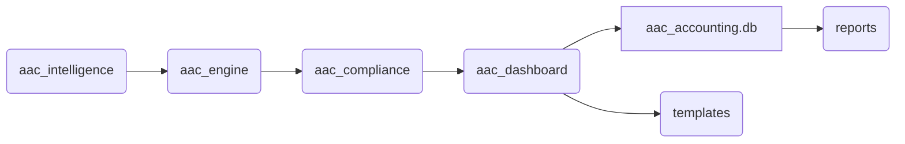

# ARCHITECTURE.md

## 1. Executive Summary

The AAC (Automated Analytics & Compliance) repository is a sophisticated software system designed to perform automated analyses and ensure compliance across various domains. The primary components of the system include analytical intelligence, an execution engine, compliance checks, and dashboard functionalities. The design prioritizes modularity and extensibility, allowing seamless integration and adaptation to evolving business needs.

The architecture has been planned diligently to handle complex data processes efficiently. This document elucidates how individual components work in harmony to deliver comprehensive analytical insights and compliance reports. It also reveals how each module interacts, data flows within the system, and highlights security and performance considerations.

## 2. System Overview

Below is a high-level ASCII diagram that outlines the major components of the AAC system and their basic interactions:

```
+-------------------+     +------------------+
|                   |     |                  |
| aac_intelligence  <---> aac_engine.py     |
|                   |     |                  |
+-------------------+     +------------------+
         |                            |
         v                            v
+-------------------+          +------------------+
|                   |          |                  |
|      aac_dashboard|          |  aac_compliance  |
|                   |          |                  |
+-------------------+          +------------------+
         |                            |
         +------------+--------------+
                      v
+---------------------------------------+
|                                       |
| aac_accounting.db | reports | templates|
|                                       |
+---------------------------------------+
```

## 3. Component Breakdown

- **aac_intelligence.py**: This module encompasses the analytical core of the system, containing algorithms and data processing logic vital for extracting meaningful insights from raw data.

- **aac_engine.py**: The engine operates as the orchestrator, managing task execution, coordination between modules, and ensuring smooth operation across different functionalities.

- **aac_compliance.py**: Dedicated to compliance checks, this module ensures that the output from the analytics phase meets predefined compliance criteria, generating alerts and reports as necessary.

- **aac_dashboard.py**: Provides the user interface layer, translating the data and compliance results into interpretable visualizations and summaries using web-based templates.

- **aac_accounting.db**: A database that stores processed data, analysis logs, and compliance check results ensuring data persistence and retrieval.

- **reports**: Directory that contains generated reports for compliance and analytics, stored as log artifacts.

- **templates**: Houses view templates for rendering dashboards and visual components.

## 4. Data Flow Description

Data flows into `aac_intelligence.py` for initial processing and analysis. The results are orchestrated by `aac_engine.py`, which passes them through `aac_compliance.py` to verify adherence to set standards. Compliance results and processed insights are then stored in `aac_accounting.db` and utilized by `aac_dashboard.py` to update the user interface. Output is ultimately displayed through web templates, generating reports saved in the `reports` directory.

## 5. Dependencies

### Internal Dependencies

- The system relies on internal module interactions primarily dictated by `aac_engine.py`, linking the analytic, compliance, and dashboard components.

### External Dependencies

- These are managed by the `requirements.txt` file which lists all the necessary third-party libraries required for the system's functionality including database drivers, web frameworks, and visualization tools.

## 6. Component Relationships



## 7. Deployment Architecture

The system is designed to be deployed on a typical LAMP or similar stack, with Python as the core programming language. The architectural design ensures that the backend processes run on a secure server while the frontend dashboard is served through standard web protocols to authorized users.

## 8. Security Considerations

Security is a core concern, with access to the system governed by robust authentication and authorization mechanisms. Data integrity is maintained using secure database storage practices and encryption protocols. Regular security audits are recommended to mitigate new vulnerabilities.

## 9. Performance Characteristics

The system is optimized for efficient data processing and minimal latency in real-time analytics. Scalability is enabled through modular architecture, allowing horizontal addition of processing units if necessary. Database indexing is crucial for quick data retrieval, enhancing overall system responsiveness.

## 10. Future Roadmap Considerations

Future enhancements may include expanding the compliance rule engine to cater for new regulations, integrating AI for predictive analytics, and improving the dashboard’s UX/UI capabilities with richer visual elements and interactivity. Regular updates to the codebase and dependencies will ensure the system aligns with the latest technological advancements.

---

This document serves as a comprehensive guide to understanding the inner workings of the AAC architecture and provides insights into its current setup and future potential.