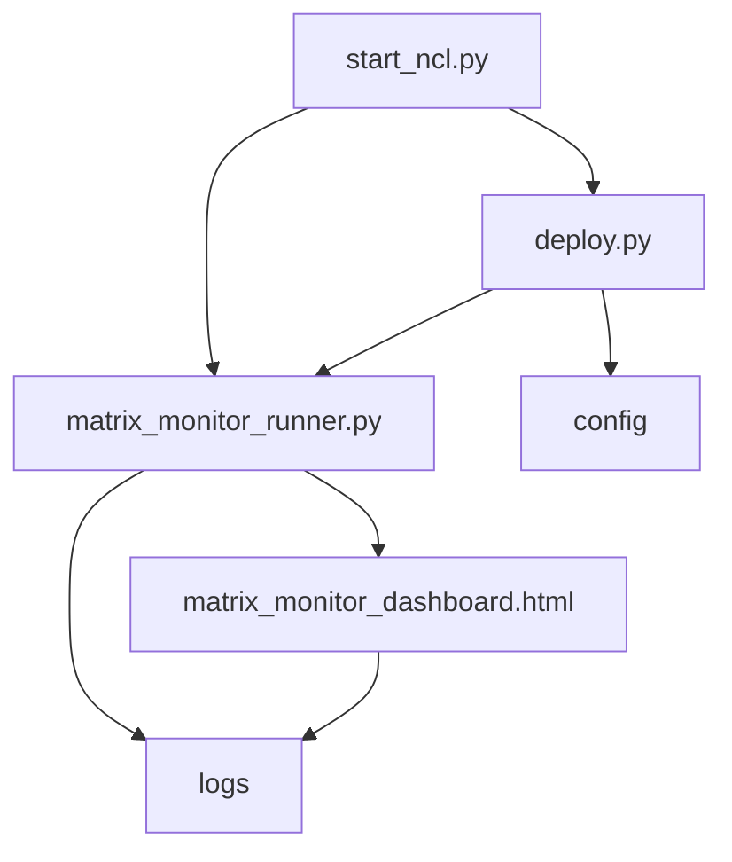

# ARCHITECTURE.md

## Executive Summary
The "NCL" repository serves as the foundational infrastructure for managing and monitoring various computational matrix operations within a cohesive environment. This repository supports deployment and execution of matrix monitoring operations along with providing a framework for continuous data analysis and reporting. Key features include a comprehensive matrix monitor dashboard and a robust deployment mechanism to ensure that the system can be efficiently managed and scaled.

The design of NCL is centered around modularity and extensibility, allowing for ease of updates and enhancements over time. Core functionalities are provided through Python scripts, and the system is further augmented by various configuration files and documentations, ensuring seamless integration and user guidance. This architecture document details the overall structure, data flow, components, dependencies, and future considerations to guide developers and stakeholders in understanding and managing the repository.

## System Overview
```plaintext
   +----------------------------------+
   |             NCL System           |
   | +------------------------------+ |
   | |          Dashboard           | |
   | |  (matrix_monitor_dashboard)  | |
   | +------------+-----------------+ |
   |              |                   |
   | +------------v--------------+    |
   | |                           |    |
   | |   Matrix Monitor Runner   |    |
   | |  (matrix_monitor_runner)  |    |
   | |                           |    |
   | +------------+--------------+    |
   |              |                   |
   | +------------v--------------+    |
   | |       Deployment          |    |
   | |        (deploy.py)        |    |
   | +---------------------------+    |
   |                                  |
   |        +-----------+             |
   |        | Config    |             |
   |        +-----------+             |
   +----------------------------------+
```

## Component Breakdown
- **start_ncl.py**: This script serves as the entry point for the NCL system, initializing necessary configurations and starting the key processes.
- **matrix_monitor_runner.py**: Core logic for executing and monitoring matrix operations, responsible for managing the lifecycle of matrix tasks.
- **deploy.py**: Script designed to handle the deployment process, ensuring that the application is appropriately set up and all dependencies are met.
- **requirements.txt**: Lists all the Python package dependencies necessary for running the system.
- **README.md**: Provides a comprehensive guide to users on setting up, configuring, and utilizing the system.
- **TECHNICAL_ARCHITECTURE.md**: The document outlining the detailed technical architecture of the system.
- **matrix_monitor_dashboard.html**: A dashboard providing visual representation and status monitoring of matrix tasks.
- **setup.py**: Used for package distribution, detailing metadata and installation instructions.
- **NCC_Master_Doctrine_v2.0.md**: A strategic document potentially outlining organizational or project-level directives pertinent to NCL.
- **IMPLEMENTATION_ROADMAP.md**: Lays out the future features and improvements planned for the system.

## Data Flow Description
Data flows from the configuration files in the `config` directory and is processed by `matrix_monitor_runner.py`. The results of these operations are logged in the `logs` directory and are visualized using `matrix_monitor_dashboard.html`. This workflow is initialized and managed through `start_ncl.py`.

## Dependencies
- **Internal**:
  - Python scripts (.py files) located in the root and `src` directory.
  - Configuration files that control operational settings.
  
- **External**:
  - Python packages specified in `requirements.txt` for additional functionality.
  - Libraries or web services required for the HTML dashboard components.

## Component Relationships


## Deployment Architecture
The deployment architecture is designed to be adaptable, suitable for both local and cloud environments. Utilizing the `deploy.py` script, the application can be rapidly provisioned, with configuration details specified in the `config` directory. The architecture allows for smooth integration with CI/CD pipelines and automatic scaling mechanisms.

## Security Considerations
The security of the system is addressed by incorporating:
- Strict access controls to sensitive files and directories.
- Regular security audits on external dependencies.
- Considerations for data encryption especially when interfacing with network services.

## Performance Characteristics
The system is optimized for performance through:
- Lightweight Python scripts reducing runtime overhead.
- Asynchronous operations within matrix processing modules.
- Efficient data caching and logging to minimize latency.

## Future Roadmap Considerations
Future enhancements will focus on expanding functionality, improving user interface and experience on the matrix dashboard, integrating machine learning capabilities for predictive matrix analysis, and enhancing deployment automation mechanisms.
