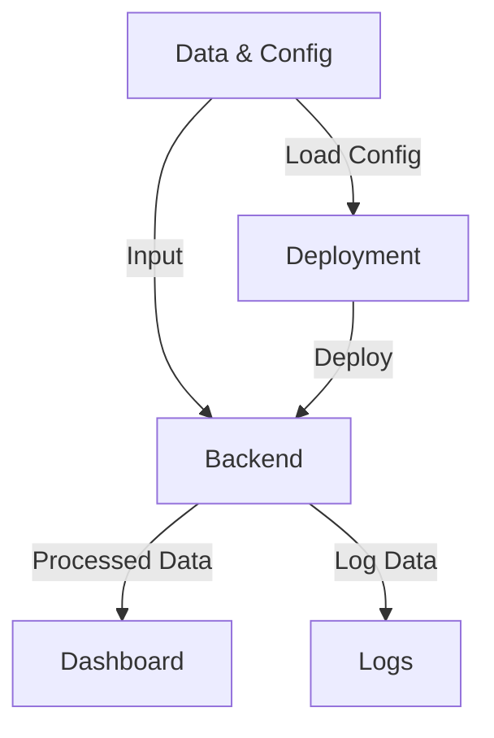

# NCL Architecture Documentation

## Executive Summary

The NCL repository is designed to be a comprehensive solution providing functionalities revolving around monitoring and deploying tasks, with an emphasis on user dashboards and reporting. It is architected to support scalable operations and offers an organized framework for both development and deployment. Comprising various components like deployment scripts, monitoring dashboards, and essential configuration tools, the NCL repository is structured to cater to both robust real-time operations and efficient batch processing.

This architecture documentation aims to guide developers through the crucial components of the NCL repository, describing the overall architecture and interaction between different pieces. The NCL system is constructed with modularity in mind, ensuring each part can be maintained or upgraded autonomously. This document outlines the structural composition of the repository, elaborates on the data flow, discusses dependencies, and contemplates security and performance prospects for future advancements.

## System Overview

The NCL repository adopts a layered architecture with well-defined components and directories to streamline interactions between different subsystems. Key files and directories form the backbone of the system, facilitating components like deployment scripts, dashboards, and configuration files to interoperate seamlessly.

```
        +----------------------------------+
        |           NCL System             |
        +----------------------------------+
        |            Dashboard             |
        |  [matrix_monitor_dashboard.html] |
        +----------------------------------+
        |            Backend               |
        |  [src/, matrix_monitor_runner.py]|
        +----------------------------------+
        |           Deployment             |
        |          [deploy.py]             |
        +----------------------------------+
        |      Config and Data Files       |
        |       [config/, data/]           |
        +----------------------------------+
        |            Documentation         |
        |    [docs/, README.md, *.md]      |
        +----------------------------------+
        |      Testing and Logs            |
        |       [tests/, logs/]            |
        +----------------------------------+
        |            Utilities             |
        |  [setup.py, requirements.txt]    |
        +----------------------------------+
```

## Component Breakdown

1. **Dashboard**:
   - File: `matrix_monitor_dashboard.html`
   - Purpose: Provides a web interface for users to monitor system metrics and performance indicators in a visual format.

2. **Backend**:
   - Files: `matrix_monitor_runner.py`, `src/`
   - Purpose: Contains the core logic and processing units of the system, triggering tasks and handling the business logic.

3. **Deployment**:
   - Files: `deploy.py`, `deploy.py.backup`
   - Purpose: Facilitates the deployment of the system to production environments, ensuring that configurations and dependencies are correctly set.

4. **Config and Data Files**:
   - Directories: `config/`, `data/`
   - Purpose: Contains configuration settings and data files necessary for the system’s operation and customization.

5. **Documentation**:
   - Directories and Files: `docs/`, `README.md`, `TECHNICAL_ARCHITECTURE.md`
   - Purpose: Provides comprehensive guides and documentation for understanding and maintaining the system.

6. **Testing and Logs**:
   - Directories: `tests/`, `logs/`
   - Purpose: Maintains test scripts and logs for debugging and quality assurance purposes.

7. **Utilities**:
   - Files: `setup.py`, `requirements.txt`
   - Purpose: Scripts and configurations required for setting up and installing project dependencies.

## Data Flow Description

The data flow within the NCL system begins with configuration settings and data inputs from the `config/` and `data/` directories. The backend (`matrix_monitor_runner.py`) processes this data, interacting with other components as required. Results from the backend processing are visualized through the `matrix_monitor_dashboard.html`, and any necessary logs are stored in the `logs/` directory. Comprehensive deployment and system operations are supported by scripts like `deploy.py`.

## Dependencies

### Internal Dependencies
- **Modules**: `matrix_monitor_runner.py` relies on modules within the `src/` directory for core functionalities.

### External Dependencies
- **Libraries**: Specified in `requirements.txt`, including web frameworks, database connectors, or other libraries needed for full operation.

## Component Relationships



## Deployment Architecture

The deployment of the NCL system relies on `deploy.py`, which automates various tasks such as setting up server environments, managing dependencies through `requirements.txt`, and ensuring configurations are correctly applied. The system is designed to be deployed on both cloud and on-premise environments, with scalability considerations incorporated in its architecture.

## Security Considerations

Security within the NCL system includes secure handling of configuration files, restricting access to sensitive logs, and ensuring only authenticated users can access the dashboard. Further measures might incorporate encryption for data at rest and in transit, regular security audits, and adherence to best practices in coding and deployment.

## Performance Characteristics

NCL has been structured to ensure efficient handling of tasks with minimal latency. Key considerations include optimizing the backend processing logic and using lightweight dashboards for real-time data visualization. Performance profiling and benchmarking are suggested in the `tests/` directory to actively monitor performance metrics.

## Future Roadmap Considerations

The roadmap for NCL includes enhancements in the dashboard visualization capabilities, more extensive testing frameworks, and improved deployment automation. Additionally, incorporating machine learning frameworks to predict system metrics and anomalies is also planned to further enhance the system’s capabilities. Expanding documentation and providing comprehensive API interfaces for external integrations is also part of the envisioned upgrades.

This architecture document should serve as a guiding framework for developers and stakeholders, providing a clear understanding of the NCL system's current state and future directions.