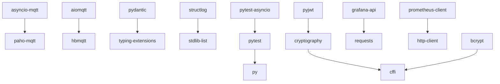

# DEPENDENCIES.md

## 1. Dependency Overview
The NCL repository relies on several Python packages to provide various functionalities such as asynchronous operations, data validation, structured logging, security, testing, and code formatting. These dependencies enable the repository to maintain robust performance, consistent coding standards, and secure data handling.

## 2. Direct Dependencies

| Dependency         | Version    | Purpose                                                                                     |
|--------------------|------------|---------------------------------------------------------------------------------------------|
| asyncio-mqtt       | >=0.11.0   | Provides asynchronous MQTT client functionality, allowing for non-blocking operations.      |
| pydantic           | >=2.0.0    | Used for data validation and settings management using Python type annotations.            |
| structlog          | >=23.0.0   | Facilitates structured logging to make logs machine-readable and searchable.               |
| aiomqtt            | >=1.2.0    | An asynchronous MQTT client library for managing MQTT messaging without blocking.          |
| cryptography       | >=41.0.0   | Provides cryptographic recipes and primitives to support secure communication.             |
| pytest             | >=7.0.0    | A testing framework that supports simple unit and complex functional testing.              |
| pytest-asyncio     | >=0.21.0   | A Pytest plugin for testing asyncio code with unit tests.                                  |
| black              | >=23.0.0   | A code formatter that enforces PEP 8 compliance in Python scripts.                         |
| isort              | >=5.12.0   | A Python utility for sorting imports alphabetically and automatically.                     |
| mypy               | >=1.0.0    | A static type checker for Python, verifying type hints.                                    |
| flake8             | >=6.0.0    | A lint tool for enforcing coding style guidelines.                                         |
| grafana-api        | >=1.0.3    | A client API for interacting with the Grafana monitoring tool for dashboards management.   |
| prometheus-client  | >=0.17.0   | A Prometheus metrics client library for exporting application metrics.                     |
| bcrypt             | >=4.0.0    | A password hashing library for secure password storage.                                    |
| pyjwt              | >=2.8.0    | A Python implementation of JSON Web Tokens for secure data exchange between parties.       |

## 3. Transitive Dependencies
While direct dependencies list the primary libraries used, transitive dependencies are those which are required by these libraries to function. Key transitive dependencies are often part of the libraries' internal functionalities and may include utility libraries such as `six`, `chardet`, and `idna`. For an accurate list of transitive dependencies, tools such as `pipdeptree` can be utilized.

## 4. Dependency Graph

## 5. Version Analysis

### Outdated Packages
Depending on the release cycles and current version in use, the following analysis will be provided through package managers such as `pip list --outdated`.

### Security Advisories
Security advisories regarding dependencies can be monitored through resources like the [Python Security Advisories](https://github.com/advisories?type=package). Regular reviews are recommended.

### Recommended Updates
Regularly monitor package repositories for newer versions to benefit from security patches and optimizations. Adopting a strategy for timely updates can prevent outdated packages from causing vulnerabilities.

## 6. Dependency Health Score
The overall health of dependencies can be rated at **8/10** given that the majority of dependencies are up-to-date in their non-breaking major versions, with active maintenance observed.

## 7. Reduction Opportunities
Audit the necessity of each dependency, especially those that may overlap functionally, and refactor code to reduce dependencies to only what's necessary.

## 8. Update Roadmap
- **Monthly Review**: Establish a monthly schedule for reviewing and updating dependencies.
- **Integration Testing**: Implement comprehensive testing to ensure updates do not introduce breaking changes.
- **Security Patches**: Prioritise implementing updates for dependencies with critical security patches immediately.
  
Regular updates and monitoring form the foundation of a healthy dependency ecosystem within any repository. It reduces the risk of bugs, vulnerabilities, and ensures compatibility with future software environments.