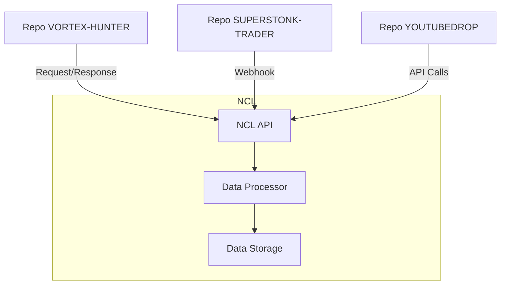
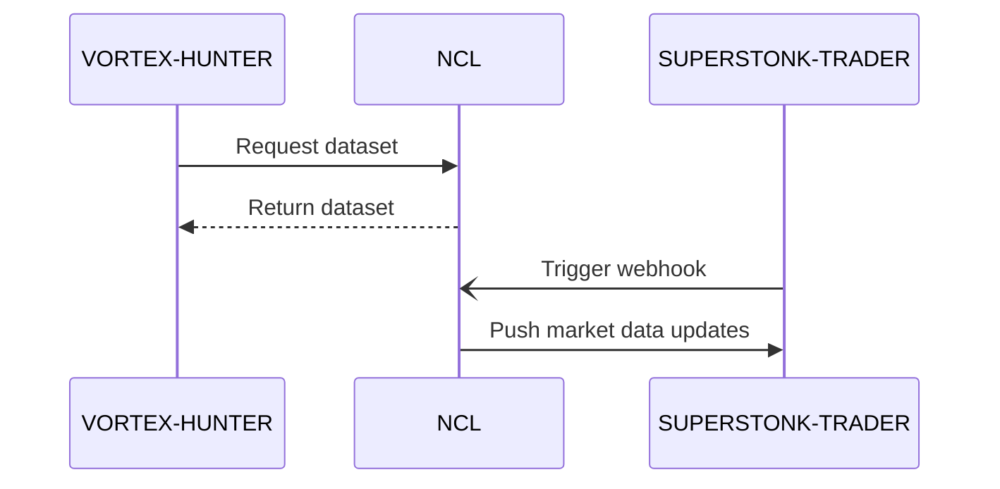

# INTEGRATION_DESIGN.md

## 1. Integration Overview

The purpose of this document is to outline the integration design for the "NCL" repository, which is part of a portfolio consisting of the following repositories: 'VORTEX-HUNTER', 'demo', 'YOUTUBEDROP', 'SUPERSTONK-TRADER', and 'HUMAN-HEALTH'. This document specifies how "NCL" will interact with these repositories, external services, and the technical details necessary to achieve seamless integration.

## 2. Current Integration Points

Currently, the "NCL" repository includes the following integration points:
- Internal data transfer via API endpoints with "VORTEX-HUNTER".
- Data synchronization tasks with "SUPERSTONK-TRADER".
- Use of shared libraries found in 'demo'.

## 3. Proposed Integrations

### With Other Portfolio Repos

#### VORTEX-HUNTER
- Deep integration involving data sharing for meteorological datasets.
- Scheduled batch updates for real-time data accuracy.
  
#### SUPERSTONK-TRADER
- Develop real-time market data feed through webhooks to push updates from NCL to SUPERSTONK-TRADER.
  
#### YOUTUBEDROP
- Implement a video analytics reporting service that fetches data from NCL.

### External Service Integrations

- Integrate with a third-party weather API to enhance data accuracy in NCL.
- Employ a cloud-based database service for scalability and redundancy.

## 4. API Design

### NCL API Endpoints

- **GET /v1/weather-data**
  - Description: Fetch and filter meteorological data.
  - Parameters: `location`, `date_range`, `data_type`.
  - Response: JSON - containing the requested dataset.
  
- **POST /v1/data-sync**
  - Description: Trigger a manual synchronization with another repository.
  - Request Body: Repository name, sync parameters.
  - Response: JSON - sync status.

## 5. Data Flow Diagrams

## 6. Authentication & Authorization

- Use OAuth 2.0 for secure API communication between the repositories.
- API Keys for external service integrations, rotated monthly for security.

## 7. Error Handling Strategy

- Implement centralized logging for all integration errors.
- Categorize errors: Critical, Major, Minor and notify the respective teams for immediate action.

## 8. Implementation Phases

### Phase 1: Initial Setup
- Define API endpoints and initial authentication setup.

### Phase 2: Internal Integration
- Establish connections with VORTEX-HUNTER and SUPERSTONK-TRADER.

### Phase 3: External Service Integration
- Connect with weather API and database services.

### Phase 4: Testing and Deployment
- Test all integrations and deploy incrementally.

## 9. Testing Strategy for Integrations

- **Unit Testing**: Each integration point should have unit tests covering typical and edge cases.
- **Integration Testing**: Simulate end-to-end flows between "NCL" and the other repositories.
- **Load Testing**: Ensure the system can handle peak loads for data synchronization tasks.
- **Security Testing**: Regularly audit and pen-test the integrations to prevent unauthorized access.

### Key Flow Sequence Diagram

This Integration Design document aims to ensure that "NCL" seamlessly integrates with other repositories in the portfolio and external services while maintaining security, efficiency, and scalability.