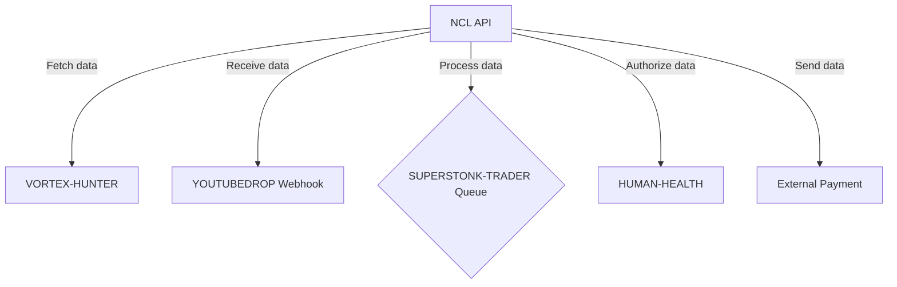
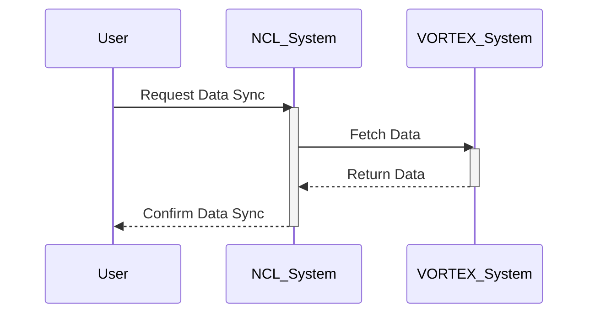

# INTEGRATION_DESIGN.md

## 1. Integration Overview

The repository "NCL" serves as a core component of our software ecosystem, intended to facilitate streamlined workflows and data consistency across all dependent systems. This integration design document details the current and proposed integration points, API design elements, data flow diagrams, and the strategy for authentication, error handling, and testing. 

## 2. Current Integration Points

Currently, the "NCL" repository integrates primarily through:
- Internal API services
- Central database connections for shared data access
- Manual data export/import processes with `VORTEX-HUNTER`

## 3. Proposed Integrations:

### With Other Portfolio Repositories:

- **VORTEX-HUNTER**: Automated data synchronization via RESTful APIs for real-time data sharing.
- **demo**: Extend APIs to support demo applications, ensuring they reflect live system behaviors.
- **YOUTUBEDROP**: Implement webhooks for immediate data updates between NCL and YOUTUBEDROP.
- **SUPERSTONK-TRADER**: Utilize message queues to manage and route trading data streams.
- **HUMAN-HEALTH**: Establish secure channels to sync patient data analytics for health monitoring.

### External Service Integrations:

- **Payment Gateway**: Connect with "Stripe" for handling financial transactions.
- **Analytics Service**: Integrate with "Google Analytics" for user interaction insights.

## 4. API Design (if applicable)

NCL will provide the following RESTful API endpoints:
- **GET /data**: Retrieve core data elements.
- **POST /data**: Submit new data entries.
- **PATCH /data/:id**: Update existing data records.
- **DELETE /data/:id**: Remove data entries.

### Example JSON for Data Entry
```json
{
  "id": "12345",
  "name": "Sample Data",
  "value": "Test value",
  "timestamp": "2023-10-01T10:00:00Z"
}
```

## 5. Data Flow Diagrams (Mermaid)



## 6. Authentication & Authorization

- Use **OAuth 2.0** for API authentication:
  - Token-based API access
  - Scopes to limit the permissions of tokens
- Implement RBAC (Role-Based Access Control) for managing user permissions within NCL.

## 7. Error Handling Strategy

- **Client-side Validation** before data submission.
- **Standardized API Error Responses**:
  - 400 for Bad Requests
  - 401 for Unauthorized Access
  - 404 for Not Found
  - 500 for Internal Server Errors
- Central logging of all integration errors for easy troubleshooting.

## 8. Implementation Phases

1. **Phase 1**: Develop and test internal API enhancements.
2. **Phase 2**: Implement and test integration with VORTEX-HUNTER.
3. **Phase 3**: Extend to demo applications and YOUTUBEDROP.
4. **Phase 4**: Integrate SUPERSTONK-TRADER and external services like Stripe.
5. **Phase 5**: Conduct performance testing and move to production.

## 9. Testing Strategy for Integrations

- **Unit Tests** for API endpoints.
- **Integration Tests** using automated scripts to test interaction with each portfolio repository.
- **End-to-End Testing** through UI testing tools to simulate real user interactions.
- **Load Testing** to ensure the system can handle high traffic.
  
### Sequence Diagrams for Key Flows



This document lays out a structured plan for integrating the "NCL" repository within its portfolio and with external platforms, ensuring a seamless, efficient, and secure ecosystem.